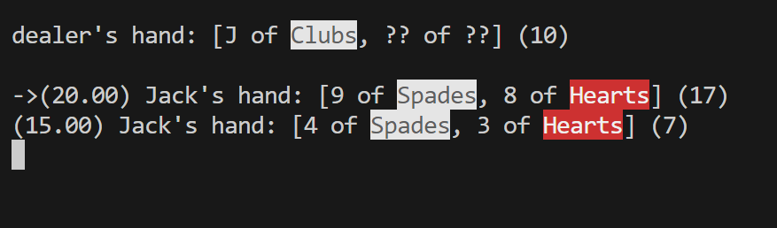

# Blackjack in the terminal



## Quickstart
```console
javac .\Blackjack.java
java .\Blackjack.java
```
## How to play
The aim of the game is to get more points than the dealer without *busting* (going over 21).
### the player can do one of 4 actions:
- h (hit) - draw a card for the current hand
- s (stand) - move on
- D (double) - doubles the current hand`s bet and draws one card face down (is revealed when the dealer reveals their card)
- S (split) - split a hand in two with the same value cards (one card is drawn automatically for each, split Aces allow only one card to be drawn)

> **NOTE:** Press `Enter` to confirm the choice. There is no limit to how many splits you can make, may luck be on your side!

## Extra reading
- A hand has 3 main parts: `(20.00) Jack's hand: [9 of Clubs, 6 of Clubs] (15)`
    - `(20.00)` bet amount
    - `[9 of Clubs, 6 of Clubs]` cards in hand
    - `(15)` value of hand (will show an `*` if hand is soft E.g. *soft fifteen*: `(*15)`)
- Dealer will automatically reveal if they have blackjack (does not offer insurance if they have a revealed Ace, will implement in the future)
- `Blackjack.main.shoe` simulates an actual shoe of cards (so card counting is possible) with a bright-coloured plastic card placed somewhere between so that at least 1/8 of the shoe remains when it gets drawn (does not get placed past the halfway point).
- `Blackjack.DECKS_IN_SHOE` controls how many 52-card decks to put in the shoe.
- `Blackjack.main.initialHands` stores what hands and their respective bets will be played each round until the shoe draws the bright-colored plastic card (hands cannot be changed between rounds for the sake of simplicity)
- `Hand.of` is a static convenience method that returns an `ArrayList` of `Hand` instances owned by a given `Player` instance.